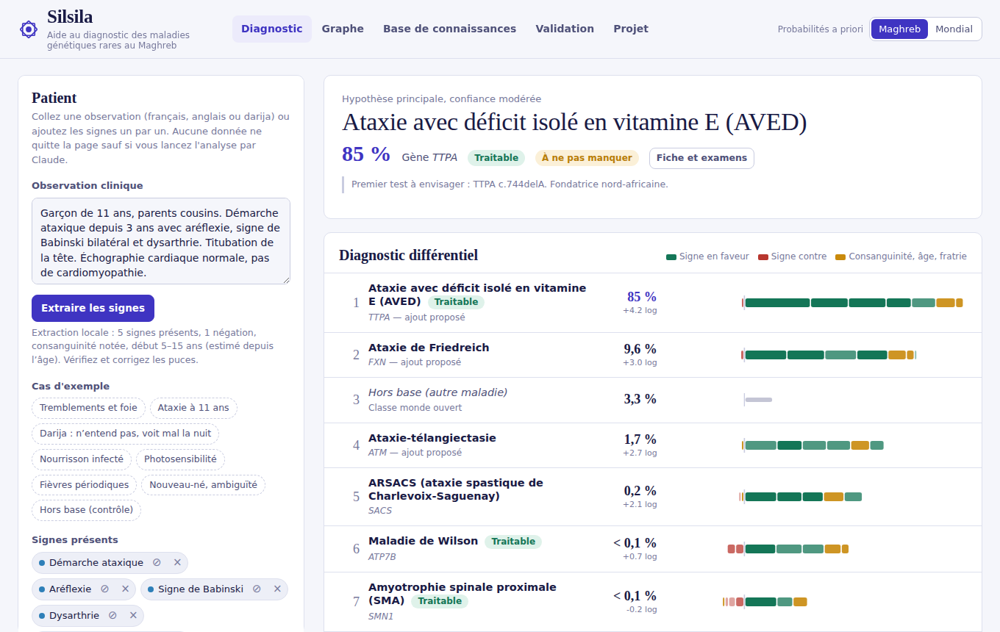
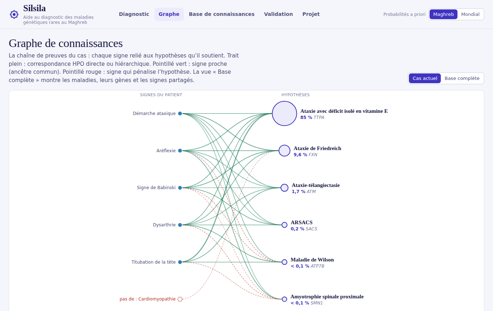
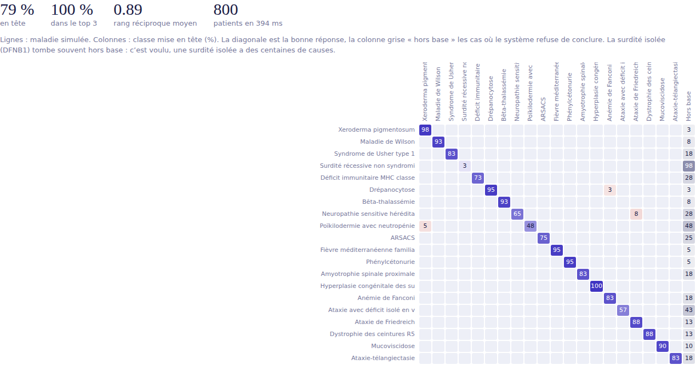

# Silsila · سلسلة

[](https://github.com/frikaya12/silsila/actions/workflows/tests.yml)
[](https://frikaya12.github.io/silsila/)
[](LICENSE)
[](https://hpo.jax.org)

**Aide au diagnostic des maladies génétiques rares liées à la consanguinité au Maghreb.**

Silsila (« la chaîne », « la lignée ») part d'une observation clinique écrite en français, en anglais ou en darija, et propose un diagnostic différentiel parmi 20 maladies récessives documentées au Maghreb. Chaque point du score est traçable jusqu'à une annotation de la Human Phenotype Ontology, et chaque hypothèse s'accompagne des variants fondateurs à tester en premier.

**▶ Essayer : [frikaya12.github.io/silsila](https://frikaya12.github.io/silsila/)** (aucune installation, aucune donnée envoyée)

> ⚠️ Prototype de recherche. Ce n'est pas un dispositif médical et il ne remplace pas l'avis d'un médecin généticien.



## Pourquoi

Au Maroc, l'errance diagnostique dure couramment de 2 à 10 ans. Environ 1,5 million de Marocains sont concernés par une maladie rare, dont 80 % d'origine génétique, et 29 à 33 % des mariages sont apparentés (40 à 49 % en Tunisie). Les outils existants sont calibrés sur des populations européennes ou nord-américaines, ou se limitent à la photo du visage. Silsila recalibre le raisonnement sur la réalité maghrébine : prévalences régionales, effet de la consanguinité, mutations fondatrices.

## Ce que fait l'application

L'onglet **Diagnostic** extrait les signes d'une note libre (négations comprises : « pas de cardiomyopathie »), les convertit en termes HPO et calcule une probabilité pour chaque maladie et pour une classe « hors base ». Il affiche la preuve signe par signe sous forme de bande colorée, propose les questions cliniques qui départageraient le mieux les hypothèses, et ouvre pour chaque maladie une fiche avec les variants fondateurs, les examens de confirmation dans l'ordre et la prise en charge. Le bouton « Maghreb / Mondial » montre l'effet du calibrage régional : dans le cas d'ataxie à 11 ans, l'AVED passe devant l'ataxie de Friedreich uniquement avec les a priori Maghreb.

L'onglet **Graphe** dessine la chaîne de preuves du cas (signes → hypothèses) ou la base complète (maladies, gènes, signes partagés). L'onglet **Base de connaissances** liste les 20 maladies et leurs sources. L'onglet **Validation** rejoue les 16 cas de référence et simule 800 patients bruités. L'onglet **Projet** reprend la feuille de route, l'architecture et les points de vigilance.



## Démarrage rapide

```bash
git clone https://github.com/frikaya12/silsila.git && cd silsila
make test && make serve
```

Aucune installation n'est nécessaire pour utiliser l'application : ouvrez `docs/index.html` dans un navigateur récent. Tout le calcul se fait localement, aucune donnée patient ne quitte la page.

Pour la servir en local :

```bash
make serve        # http://localhost:8000
```

Version en ligne : <https://frikaya12.github.io/silsila/>, publiée par GitHub Pages depuis le dossier `/docs` de la branche `main`. Pour votre propre copie (fork), activez Pages de la même façon dans les paramètres du dépôt.

## Structure du dépôt

```
silsila/
├── docs/
│   ├── index.html            application complète en un seul fichier (générée)
│   ├── revue-curation.md     couche Maghreb à faire relire par un généticien (générée)
│   └── img/                  captures d'écran
├── src/
│   ├── engine.js             moteur de score (rapports de vraisemblance sur HPO)
│   ├── nlp.js                extraction des signes, négation, âge, consanguinité
│   ├── lexicon.js            synonymes cliniques français et darija → HPO
│   ├── app.js                interface
│   └── template.html         structure et styles
├── data/
│   ├── kb.json               base de connaissances compilée (HPO + curation)
│   ├── cases.json            16 cas de référence
│   └── extra_terms.json      termes HPO ajoutés au vocabulaire
├── scripts/
│   ├── download_hpo.sh       téléchargement HPO (version figée v2026-09-01)
│   ├── build_kb.py           ontologie, contenu informatif, annotations
│   ├── curate.py             couche Maghreb : prévalences, variants, examens
│   ├── fr_patch.py           libellés français manquants, corrections
│   ├── export_curation.py    génère docs/revue-curation.md
│   └── assemble.py           génère docs/index.html
├── tests/
│   ├── test_engine.js        cas de référence, simulation, seuils de non-régression
│   └── test_nlp.js           extraction en français et en darija
└── Makefile
```

Prérequis pour développer : Python ≥ 3.9 et Node ≥ 18, sans aucune dépendance externe. L'interface charge d3 v7.8.5 depuis cdnjs.

## Commandes

```bash
make test         # cas de référence, simulation, extraction (échoue en cas de régression)
make build        # régénère docs/index.html après modification de src/ ou data/
make kb           # retélécharge HPO et reconstruit data/kb.json de bout en bout
make curation     # régénère la fiche de relecture pour le généticien
```

`make kb` reproduit à l'identique le fichier `data/kb.json` livré, à partir de la version HPO figée. Pour partir de la dernière version : `HPO_VERSION=latest make kb`, puis `make test` pour vérifier que les performances tiennent. L'intégration continue GitHub (`.github/workflows/tests.yml`) lance les tests à chaque push et vérifie que `docs/index.html` correspond bien aux sources.

## Méthode

Pour chaque maladie *M* et chaque signe *s* du patient, le moteur calcule un rapport de vraisemblance LR = P(s | M) / P(s), dans l'esprit de LIRICAL. P(s | M) vient des fréquences HPO (catégories Orphanet, ou comptes OMIM lissés par Laplace) ; P(s) est la fraction des 12 867 maladies de référence annotées avec ce signe ou un descendant, si bien qu'un signe rare pèse lourd et un signe banal presque rien. La correspondance suit l'ontologie : exacte, plus générale, plus précise, ou « proche » via l'ancêtre commun le plus informatif. Un signe inexpliqué vaut LR = 0,12 ; un signe recherché et absent vaut (1 − f) / (1 − P(s)).

Les signes étant corrélés, leur somme en log est pondérée par τ = 0,6. La consanguinité agit via un modèle de génétique des populations : pour une maladie récessive de prévalence *p*, le risque relatif chez un enfant d'union apparentée vaut 1 + F(1 − q)/q avec q = √p et F = 1/32. Pour la maladie de Wilson, le modèle prédit 72 % d'unions apparentées chez les patients, contre 63 % observés dans la série du CHU de Marrakech. Une classe « hors base », de prévalence cumulée 20 fois supérieure à la base, absorbe les tableaux mal expliqués. Les questions suivantes sont choisies pour maximiser le gain d'information attendu.

Le classement est déterministe et auditable ligne à ligne. Le modèle de langage n'intervient qu'aux deux extrémités, là où il est utile : lire une note complexe et rédiger une synthèse qui ne cite que des sources fournies.

## Résultats actuels

| Évaluation | En tête | Top 3 |
|---|---|---|
| 16 cas de référence, a priori Maghreb | 15 / 16 | 16 / 16 |
| 800 patients simulés et bruités | 79 % | 100 % |



Ces chiffres sont des **bornes hautes** : les cas de référence ont été construits par l'équipe qui a construit la base, et les patients simulés sont tirés des mêmes annotations. La prochaine étape crédible est un jeu de 50 à 100 cas marocains publiés, dont les phénotypes sont extraits sans connaître le diagnostic, puis un pilote prospectif. Le seul cas manqué (paraplégie spastique avec maux perforants, trois signes) est un échec assumé : le système préfère « hors base » plutôt qu'une fausse certitude.

## Analyse par Claude

Quand la page est ouverte comme artefact dans Claude, deux fonctions supplémentaires s'activent : l'extraction des signes par Claude pour les notes difficiles (avec contrôle croisé identifiant/libellé contre les hallucinations) et une synthèse clinique rédigée qui ne cite que les preuves calculées. Hébergée ailleurs, sur GitHub Pages par exemple, l'application fonctionne entièrement sans ces deux fonctions : extraction locale, classement, questions, fiches et export du compte rendu restent disponibles. Brancher un modèle de langage auto-hébergé passe par un petit service (FastAPI par exemple), prévu dans la feuille de route.

## Limites connues

Les prévalences maghrébines sont des estimations à confirmer. La couche de curation (variants fondateurs, examens, fréquences corrigées à la main) doit être relue par un généticien : [`docs/revue-curation.md`](docs/revue-curation.md) la présente sous forme de liste à cocher. 128 termes HPO sans traduction française officielle ont été traduits par l'équipe. Le lexique darija est une première version, à enrichir avec des notes réelles. La littérature surreprésente les familles publiées, et donc certains variants.

Avant tout pilote sur des données patients : déclaration à la CNDP (loi 09-08), avis d'un comité d'éthique, et analyse du statut réglementaire (loi 84-12 relative aux dispositifs médicaux au Maroc, règlement MDR pour l'Europe).

## Feuille de route

| Phase | Mois | État |
|---|---|---|
| Recherche et validation des maladies cibles | M1 | à faire |
| Prototype v1 : moteur de matching, base de connaissances | M2 | **livré** |
| Tests avec 2 à 3 médecins | M3 | à faire |
| Extension : graphe, interface, 30 à 40 maladies | M4–M5 | en partie livré (graphe, interface, 20 maladies) |
| Premier pilote | M6 | à faire |
| Itération post-pilote, publication | M7–M8 | à faire |
| Recherche de financement et partenariats | M9–M10 | à faire |
| Bilan à 12 mois et suite du projet | M11–M12 | à faire |

## Données et licences

Le code est publié sous licence MIT (voir [`LICENSE`](LICENSE)). Les données incluses dans `data/kb.json` gardent leurs propres conditions.

**Human Phenotype Ontology** (version 2026-09-01, annotations 2026-09-02). Ce produit utilise la Human Phenotype Ontology ; plus d'informations sur <https://hpo.jax.org>. Référence : Gargano MA *et al.*, « The Human Phenotype Ontology in 2024: phenotypes around the world », *Nucleic Acids Research* 2024;52(D1):D1333–D1346. Les libellés français proviennent des traductions officielles HPO ; les 128 libellés ajoutés par Silsila (`scripts/fr_patch.py`) ne sont pas des traductions officielles.

**Orphanet** : annotations diffusées via HPO, sous licence CC BY 4.0. **OMIM** : identifiants et annotations diffusés via HPO ; toute réutilisation directe des données OMIM est soumise aux conditions d'OMIM (<https://omim.org>).

**d3.js** : licence ISC.

## Avertissement

Silsila est un outil d'aide à la réflexion pour des professionnels de santé. Il peut se tromper, n'a pas été validé cliniquement et ne doit pas être utilisé pour poser ou exclure un diagnostic.
